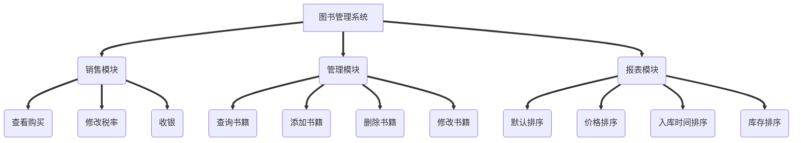
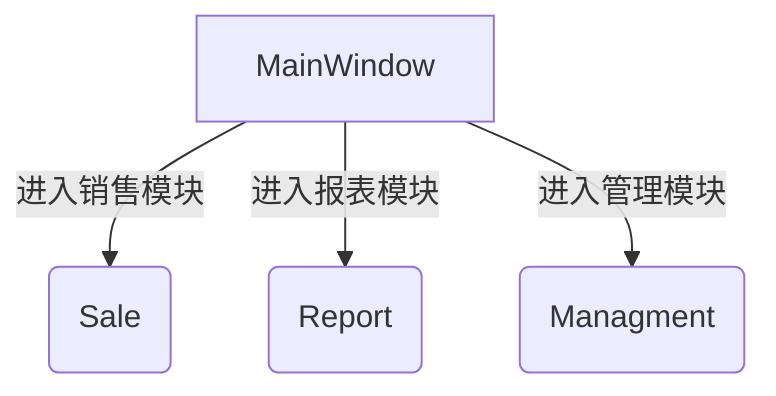

[TOC]
# 《面向对象程序设计》报告
## 图书管理系统的设计与实现   
班级：<u>1618203</u>  

学号：<u>1161820323</u>  

姓名：<u>刘嘉木</u>  

指导教师：<u>许娟</u>  

完成时间：<u>2018年5月8日</u>  

********************************  
## 依赖
* Qt>=5.0
* mysql驱动>=4.0
* 在mainwindow.cpp中自行配置服务器
## 一、程序的主要功能
本程序为图书管理系统，由收银、管理、报表三部分组成。共同完成用户买书、员工管理书库、报表打印三项主要功能。具体如下：
*  为用户买书提供界面，并提供书单，同时支持批量购买、模糊查询、计算费用。后台自动完成书目的相应扣除与整理。
*  为管理者提供管理界面，支持修改、添加、删除图书信息，修改税率，查找图书的方式支持多项模糊查询。
*  为管理者提供报表界面，支持默认顺序查看书库、批发价顺序查看书库、零售价顺序查看书库、书数量顺序查看书库、进书日期顺序查看书库。
*  采用数据库编程实时共享书库数据
## 二、系统的总框架图

## 三、各个类的说明
* Mainwindow类主要包含了三个按钮，分别连向消费、管理、报表三个模块的Dilog窗口。
* Report类除了包含这个界面所需的窗口，还包含了对报表进行操作的函数。
* Sale类实现了修改税率和将已购书籍现实的功能
* Management类实现了对数据库内容的增删查改找。
## 四、模块分析

$~~$***为了减少不必要的窗口，本程序尽量在一个三个模块对应的三个窗口中完成全部的任务。采用的思路是每个模块在一个功能执行时将其它功能对应的控件隐藏，当触发该功能时再将这个功能的控件现实，其它功能的控件隐藏***
## 五、存在的不足与对策
* 编程思路上没能很好的使用MVC(model view controler)的思想进行编程，图形界面设计和功能函数设计混杂在一起，下次开发时一定多加注意
* 功能实现上还有一些不人性话的地方，比如修改完成后应该返回主界面，或者报表模块，给予用户修改成功的反馈，其它例如查询操作进行操作完后没能将输入框清空。
* 没有合理的使用析构函数，合理使用后应该能使程序所占内存更少，运行更快。
* 应将数据库编程与文件操作结合使用，达到在线和离线操作都可以进行的效果，并在本地可以设置备份数据
## 六、编程体会
* 编程前一定要有总体的思路，大方向一定要明确，否则后面修改起来很困难。然后功能要一个一个实现，这样可以保证bug的减少。最后要把握好开发的节奏和进度，了解自己的速度和水平很重要，尤其用到不熟悉的技能时更要留出足够充分的时间，不然很难保质保量完成任务
## 七、程序源码
### main.cpp
```C++
#include "mainwindow.h"
#include <QApplication>
#include <QIcon>
int main(int argc, char *argv[])
{
    QApplication a(argc, argv);
    MainWindow w;
    w.show();
    return a.exec();
}
```
### mainwindow.h
```C++
#ifndef MAINWINDOW_H
#define MAINWINDOW_H
#include "sale.h"
#include <QMainWindow>
#include "management.h"
#include "report.h"

namespace Ui {
class MainWindow;
}

class MainWindow : public QMainWindow
{
    Q_OBJECT

public:
    explicit MainWindow(QWidget *parent = nullptr);
    ~MainWindow();
    void paintEvent(QPaintEvent *);

private slots:
    void on_pushButton_clicked();

    void on_pushButton_4_clicked();

    void on_pushButton_2_clicked();

    void on_pushButton_3_clicked();

    void on_actionhelp_triggered();

    void on_actionadd_triggered();

    void on_actionthanks_triggered();

private:
    Ui::MainWindow *ui;
    Sale *custom;
    Management *manboss;
    Report *reboss;
};

#endif // MAINWINDOW_H

```
### mainwindow.cpp
```C++
#include "mainwindow.h"
#include "ui_mainwindow.h"
#include <QMessageBox>
#include <QIcon>
#include <QSqlDatabase>
#include <QMessageBox>
#include <QSqlQuery>
#include <QPainter>
#include <QTimer>
#include <QBitmap>


MainWindow::MainWindow(QWidget *parent) :
    QMainWindow(parent),
    ui(new Ui::MainWindow)
{
    ui->setupUi(this);
    this->setWindowTitle("图书管理系统");
    //链接数据库
    //使用sql odbc插件
    QSqlDatabase db = QSqlDatabase::addDatabase("QMYSQL");
    //远程连接
    db.setHostName("******");
    db.setPort(3306);
    db.setDatabaseName("******");
    db.setUserName("******");
    db.setPassword("******");

    if(db.open()==false){
        QMessageBox::critical(this,"warning","it cannot open datebase \nPlease check the network connection");
    }
    //设置图片
    this->setWindowIcon(QIcon(":/image/icon.png"));
    //时间显示的实现
    //启用计时器 1s更新1次
    QTimer *timer = new QTimer(this);
    timer->start(1000);
    connect(timer,&QTimer::timeout,[=](){
        QDateTime time = QDateTime::currentDateTime();
        QString timeStr = time.toString("yyyy-MM-dd hh:mm:ss");
        ui->time_label->setText(timeStr);
    });


}

MainWindow::~MainWindow()
{
    delete ui;
}

void MainWindow::on_pushButton_clicked()
{
    custom = new Sale;
    custom ->exec();
}

void MainWindow::on_pushButton_4_clicked()
{
    this->close();
}

void MainWindow::on_pushButton_2_clicked()
{
    manboss = new Management;
    manboss->exec();
}

void MainWindow::on_pushButton_3_clicked()
{
    reboss = new Report;
    reboss->exec();
}

void MainWindow::on_actionhelp_triggered()
{
    QMessageBox::information(this, tr("图书管理系统"),
                                     tr("详情请见帮助文档"));

}

void MainWindow::on_actionadd_triggered()
{
    QMessageBox::information(this, tr("图书管理系统"),
                                     tr("161820323刘嘉木\n"
                                        "id wood"));
}
void MainWindow::paintEvent(QPaintEvent *)
{
    //背景
    QPainter painter(this);
    QPixmap pix(":/image/beg.png");
    painter.drawPixmap(0,0,900,600,pix);
    //logo显示
    QPainter painter_logo(this);
    painter_logo.drawPixmap(20,708,QPixmap(":/image/logo.png"));

}

void MainWindow::on_actionthanks_triggered()
{
    QMessageBox::information(this, tr("特别感谢"),
                                     tr("网易云课堂qt入门精讲\n"
                                        "陈楚燚 id:desperado 给予的技术上的支持\n"
                                        "刘志赞 id:Kitty 给予的服务器支持"));
}

```
### report.h
```C++
#ifndef REPORT_H
#define REPORT_H

#include <QDialog>
#include <QTableWidget>

namespace Ui {
class Report;
}

class Report : public QDialog
{
    Q_OBJECT

public:
    explicit Report(QWidget *parent = nullptr);
    ~Report();
    void paintEvent(QPaintEvent *);

private slots:
    void on_pushButton_2_clicked();

    void on_pushButton_3_clicked();

    void on_pushButton_4_clicked();

    void on_pushButton_clicked();

private:
    Ui::Report *ui;
    QTableWidget *tableui;
};

#endif // REPORT_H

```
### report.cpp
```C++
#include "report.h"
#include "ui_report.h"
#include <QSqlQuery>
#include <QTableWidget>
#include <QPainter>

Report::Report(QWidget *parent) :
    QDialog(parent),
    ui(new Ui::Report)
{
    ui->setupUi(this);
    //设置标题
    this->setWindowTitle("报表模块");
    this->setWindowIcon(QIcon(":/image/icon.png"));
}

Report::~Report()
{
    delete ui;
}

void Report::on_pushButton_2_clicked()
{
    tableui = new QTableWidget(this);
    tableui->move(200,110);
    tableui->setFixedSize(600,280);
    tableui->setColumnCount(3);
    tableui->setHorizontalHeaderLabels(QStringList() << "书名"<< "ISBN"<< "库存量");
    QSqlQuery sqlquery;
    QString sql;
    sql = "select * from Book order by stock desc";
    sqlquery.exec(sql);
    int i=0;
    while(sqlquery.next())
    {
        tableui->setRowCount(i+1);
        tableui->setItem(i,0,new QTableWidgetItem(sqlquery.value(1).toString()));
        tableui->setItem(i,1,new QTableWidgetItem(sqlquery.value(2).toString()));
        tableui->setItem(i,2,new QTableWidgetItem(sqlquery.value(6).toString()));
        i++;
    }
    tableui->show();
}

void Report::on_pushButton_3_clicked()
{
    tableui = new QTableWidget(this);
    tableui->move(200,110);
    tableui->setFixedSize(600,280);
    tableui->setColumnCount(3);
    tableui->setHorizontalHeaderLabels(QStringList() << "书名"<< "ISBN"<< "入库日期");
    QSqlQuery sqlquery;
    QString sql;
    sql = "select * from Book order by date";
    sqlquery.exec(sql);
    int i=0;
    while(sqlquery.next())
    {
        tableui->setRowCount(i+1);
        tableui->setItem(i,0,new QTableWidgetItem(sqlquery.value(1).toString()));
        tableui->setItem(i,1,new QTableWidgetItem(sqlquery.value(2).toString()));
        tableui->setItem(i,2,new QTableWidgetItem(sqlquery.value(5).toString()));
        i++;
    }
    tableui->show();
}

void Report::on_pushButton_4_clicked()
{
    tableui = new QTableWidget(this);
    tableui->move(200,110);
    tableui->setFixedSize(600,280);
    tableui->setColumnCount(3);
    tableui->setHorizontalHeaderLabels(QStringList() << "书名"<< "ISBN"<< "库存量");
    QSqlQuery sqlquery;
    QString sql;
    sql = "select * from Book order by stock desc";
    sqlquery.exec(sql);
    int i=0;
    while(sqlquery.next())
    {
        tableui->setRowCount(i+1);
        tableui->setItem(i,0,new QTableWidgetItem(sqlquery.value(1).toString()));
        tableui->setItem(i,1,new QTableWidgetItem(sqlquery.value(2).toString()));
        tableui->setItem(i,2,new QTableWidgetItem(sqlquery.value(6).toString()));
        i++;
    }
    tableui->show();
}

void Report::on_pushButton_clicked()
{
    tableui = new QTableWidget(this);
    tableui->move(200,110);
    tableui->setFixedSize(600,280);
    tableui->setColumnCount(8);
    tableui->setHorizontalHeaderLabels(QStringList() << "ISBN"<< "书名"<< "作者"<< "出版社"<< "进书日期"<< "库存量"<< "批发价"<<"零售价");
    QSqlQuery sqlquery;
    QString sql;
    sql = "select * from Book";
    sqlquery.exec(sql);
    int i=0;
    while(sqlquery.next())
    {
       tableui->setRowCount(i+1);
       tableui->setItem(i,0,new QTableWidgetItem(sqlquery.value(2).toString()));
       tableui->setItem(i,1,new QTableWidgetItem(sqlquery.value(1).toString()));
       tableui->setItem(i,2,new QTableWidgetItem(sqlquery.value(3).toString()));
       tableui->setItem(i,3,new QTableWidgetItem(sqlquery.value(4).toString()));
       tableui->setItem(i,4,new QTableWidgetItem(sqlquery.value(5).toString()));
       tableui->setItem(i,5,new QTableWidgetItem(sqlquery.value(6).toString()));
       tableui->setItem(i,6,new QTableWidgetItem(sqlquery.value(7).toString()));
       tableui->setItem(i,7,new QTableWidgetItem(sqlquery.value(8).toString()));
       i++;
    }
    tableui->show();
}
void Report::paintEvent(QPaintEvent *)
{
    //背景
    QPainter painter(this);
    QPixmap pix(":/image/beg.png");
    painter.drawPixmap(0,0,900,600,pix);
}

```
### sale.h
```C++
#ifndef SALE_H
#define SALE_H

#include <QDialog>

namespace Ui {
class Sale;
}

class Sale : public QDialog
{
    Q_OBJECT

public:
    explicit Sale(QWidget *parent = nullptr);
    ~Sale();
    void set_money();//设置消费总额和应付总额；
    void set_taxRate();//设置税率
    double get_tax();//返回税率
    double get_sale();//返回消费总额
    double get_total();//返回消费数
    void paintEvent(QPaintEvent *);

private slots:
    void on_ser_btn_clicked();

    void on_cagtax_btn_clicked();

    void on_check_btn_clicked();

private:
    Ui::Sale *ui;
    double tax=0;
    double sale=0;
    double total=0;
    double tax_rate = 0;
    int i=0;
};

#endif // SALE_H

```
### sale.cpp

```C++
#include "sale.h"
#include "ui_sale.h"
#include <QSqlQuery>
#include <QMessageBox>
#include <QtDebug>
#include <QSqlQuery>
#include <QTableWidget>
#include <QInputDialog>
#include <QPainter>

Sale::Sale(QWidget *parent) :
    QDialog(parent),
    ui(new Ui::Sale)
{
    ui->setupUi(this);
    this->setWindowTitle("销售模块");
    this->setWindowIcon(QIcon(":/image/icon.png"));
    set_taxRate();
    set_money();
}
Sale::~Sale()
{
    delete ui;
}
void Sale::set_taxRate()
{
    QSqlQuery sqlquery;
    QString sql;
    sql = "select rate from tax";
    sqlquery.exec(sql);
    sqlquery.first();
    tax_rate = sqlquery.value(0).toDouble();
}
double Sale::get_tax()
{
    return tax;
}
double Sale::get_sale()
{
    return sale;
}
double Sale::get_total()
{
    return total;
}
void Sale::set_money()
{
    ui->tax_label->setText(QString::number(get_tax(), 10, 2) + "RMB");
    ui->sale_label->setText(QString::number(get_sale(), 10, 2) + "RMB");
    ui->total_label->setText(QString::number(get_total(), 10, 2) + "RMB");
}

//void Sale:


//查询操作
void Sale::on_ser_btn_clicked()
{
    ui->buy_vi->setColumnCount(4);
    ui->buy_vi->setRowCount(i+1);
    if(QMessageBox::Yes == QMessageBox::question(this,"确认","确定购买吗?确认后无法取消购买操作。",QMessageBox::Yes | QMessageBox::No,QMessageBox::No))
    {
        QString a;
        if(ui->name_txt->text() == "")
        {
            QMessageBox::critical(this,"error","请输入书籍名称！");
            return;
        }
        else
        {
            a = QString("select * from Book where name = '%1'").arg(ui->name_txt->text());
        }
        QSqlQuery sqlquery2;
        sqlquery2.exec(a);
        if(!sqlquery2.next())
        {
            QMessageBox::information(this,"error","未找到指定图书");
            return;
        }
        else {
            if(sqlquery2.value(6).toInt()<1)
            {
                QMessageBox::information(this,"不足",QString("库存不足。当前此书库存为%1本").arg(sqlquery2.value(6).toString()));
            }
            else
            {
                QMessageBox::information(this,"成功","购买成功");
                sale+=sqlquery2.value(8).toDouble();
                tax = tax_rate * sale;
                total = sale + tax;
                ui->tax_label->setText(QString::number(get_tax(), 10, 2) + "RMB");
                ui->sale_label->setText(QString::number(get_sale(), 10, 2) + "RMB");
                ui->total_label->setText(QString::number(get_total(), 10, 2) + "RMB");
                ui->buy_vi->setItem(i,0,new QTableWidgetItem(sqlquery2.value(2).toString()));
                ui->buy_vi->setItem(i,1,new QTableWidgetItem(sqlquery2.value(1).toString()));
                ui->buy_vi->setItem(i,2,new QTableWidgetItem(sqlquery2.value(8).toString()));
                ui->buy_vi->setItem(i,3,new QTableWidgetItem(QString("%1").arg(sqlquery2.value(8).toDouble())));
                i++;
            }

        }
    }
}
//修改税率
void Sale::on_cagtax_btn_clicked()
{
    bool isok;
    QString taxrare1;
    QString tax_rate1= QInputDialog::getText(this,"改变税率","请输入税率",QLineEdit::Normal,taxrare1,&isok);
    if(isok)
    {
        if(tax_rate1.toDouble()>0)
        {
            QSqlQuery sqlquery1;
            QString a;
            tax = sale*tax_rate1.toDouble();
            total = tax + sale;
            set_money();
            QMessageBox::information(this,"成功","修改税率成功");
            a = QString("update tax set rate = %1 where id = 1").arg(tax_rate1.toDouble());
            sqlquery1.exec(a);
        }
        else {
            QMessageBox::information(this,"失败","修改税率失败");
        }
    }
}
//收银
void Sale::on_check_btn_clicked()
{
    tax = 0;
    sale = 0;
    total = 0;
    QMessageBox::question(this,"确认","确定收银吗?",QMessageBox::Yes | QMessageBox::No,QMessageBox::No);
    QMessageBox::information(this,"成功","收银成功");
    this->close();
}
void Sale::paintEvent(QPaintEvent *)
{
    //背景
    QPainter painter(this);
    QPixmap pix(":/image/beg.png");
    painter.drawPixmap(0,0,900,600,pix);
}

```# A-Library-Management-System
